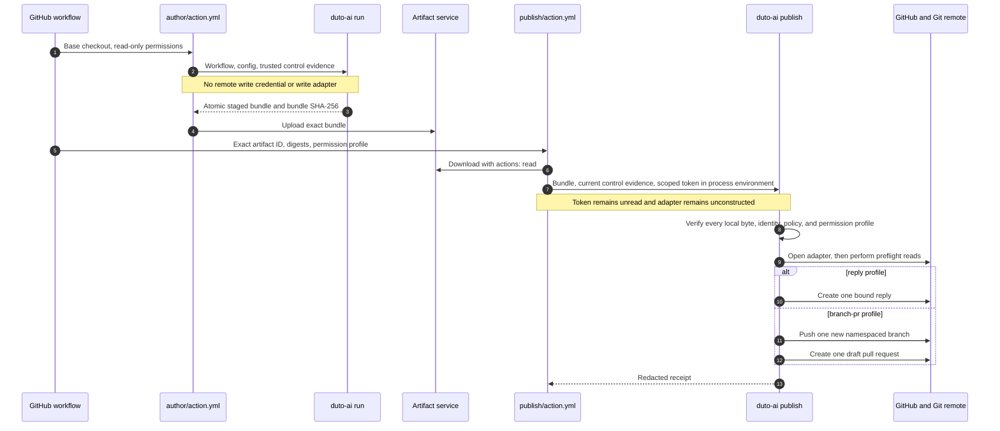

# ADR 011: Focused M3 authoring and staged publication contract

- **Status:** Accepted contract; implementation pending
- **Date:** 2026-08-25
- **Scope:** One writable workspace, bounded local authoring, staged-only safe outputs, one fixed publisher, separate M3 Actions, and focused GitHub acceptance
- **Depends on:** ADR 002, ADR 003, ADR 004, ADR 006, ADR 008, ADR 009, and ADR 010

## Context

M1 ships the host-neutral `validate`, `plan`, and one-shot `run` commands. M2 ships the sealed root composite Action over that runtime. Neither milestone writes repository files, creates commits, publishes Git refs, or changes GitHub resources.

ADR 003 defines a broader trust and safe-output direction. This ADR selects the first implementation slice. It deliberately supports one writable repository, one local commit, and staged publication through a separate trusted process. It does not implement ADR 003 direct mode or its deferred issue, check, general-comment, and label operations.

The current M2 shell classifier is not M3 authority. It cannot resolve the complete tool expression and delegated-agent graph. M3 derives authority in Go from typed control evidence and the compiled effective plan before providers, models, tools, processes, credentials, or remote adapters are constructed.

## Decision

M3 adds a focused authoring path with these rules:

1. A strict trusted control-evidence document normalizes the run to `forked_pr`, `same_repository`, `scheduled`, `local`, or `unknown`.
2. The effective plan intersects the normalized context, the fixed capability table, trusted explicit admission, exact tool scopes, workspace access, and delegated-child authority.
3. An authoring run may write beneath one workspace and create at most one deterministic local commit.
4. Remote work is always `staged`. The authoring process has no remote write adapter or write credential.
5. A complete evidence bundle contains zero or one closed operation set: one `conversation.reply`, or `git.branch.publish` followed by `pull_request.create_draft`.
6. `duto-ai publish` verifies the complete local bundle and policy before opening a private remote adapter. It then preflights remote state and applies fixed operations.
7. M3 uses `author/action.yml` and `publish/action.yml` in distinct jobs. The root `action.yml` and `action/` directory remain the M2 contract.

## Authority and construction order

The fixed order is:

1. Strict-decode trusted configuration, portable workflow, workflow inputs, and control evidence.
2. Normalize the trust context.
3. Validate names, schemas, bounds, exact tool sets, workspace subsets, delegation, and graph safety.
4. Intersect catalog capability, context eligibility, and trusted explicit admission.
5. Produce the immutable effective plan and its digest.
6. Reject any unadmitted capability.
7. Construct providers, models, tools, processes, or the local authoring implementation only after steps 1 through 6 succeed.
8. Complete the run and write the M3 bundle atomically.
9. In a separate publisher process, verify every local byte and identity binding before opening the remote adapter or reading a write credential.

A rejection through step 6 makes all provider, model, tool-family, filesystem-mutation, Git-mutation, credential-open, and HTTP-write counters remain zero.

## Trusted control evidence

### Transport

`--control-evidence FILE` reads one regular, non-symlink, UTF-8 JSON file of at most 65,536 bytes. The decoder rejects unknown fields, duplicate keys, explicit null, numbers outside their declared range, trailing tokens, and more than one JSON value. `--control-evidence -` is invalid. Portable workflow data, workflow inputs, prompt text, repository files, Git metadata outside the attested checkout, model output, and tool output cannot populate this document.

The GitHub author Action creates the document under `RUNNER_TEMP` from fixed GitHub context fields and its verified checkout. A local operator creates the local variant outside workflow-controlled data. Supplying this file is an assertion by the CLI caller; duto does not make a hostile parent process safe.

### GitHub variant

This is the complete GitHub shape:

```json
{
  "version": 1,
  "source": "github",
  "repository": {
    "id": "1001",
    "owner_id": "2001",
    "owner": "example-owner",
    "name": "example-repository",
    "default_branch": "main"
  },
  "event": {
    "name": "issues",
    "actor_id": "3001",
    "subject": {"kind": "issue", "number": 42},
    "base": {
      "repository_id": "1001",
      "ref": "refs/heads/main",
      "sha": "1111111111111111111111111111111111111111"
    },
    "head": {
      "repository_id": "1001",
      "ref": "refs/heads/main",
      "sha": "1111111111111111111111111111111111111111"
    }
  },
  "run": {
    "id": "4001",
    "attempt": 1,
    "workflow_sha": "2222222222222222222222222222222222222222"
  },
  "checkout": {
    "ref": "refs/heads/main",
    "sha": "1111111111111111111111111111111111111111"
  },
  "admission": {
    "id": "focused-m3",
    "correlation_key": "issue-42-authoring",
    "issued_at": "2026-08-25T12:00:00Z",
    "expires_at": "2026-08-25T18:00:00Z"
  }
}
```

Field rules:

- Decimal IDs are non-empty ASCII digit strings. They are compared as strings.
- Repository owner and name use `[A-Za-z0-9_.-]+`. Authority comparisons use stable repository and owner IDs, not names.
- Revisions are lowercase 40-character hexadecimal object IDs. Refs are full `refs/heads/...` names.
- Event name is one of `workflow_dispatch`, `schedule`, `push`, `pull_request`, `issues`, or `issue_comment`.
- Subject kind is `none`, `issue`, or `pull_request`. Its number is `0` exactly when kind is `none`; otherwise it is positive.
- `pull_request` uses the event's base and head repository IDs, refs, and SHAs. The checked-out SHA must equal the base SHA.
- `push` uses the pushed repository and ref. Head is the pushed SHA; base is the attested parent or, for a new ref, the checked-out default-branch SHA.
- `workflow_dispatch` and `schedule` use the checked-out repository/ref/SHA for both base and head and use subject `none`.
- `issues` uses subject `issue`. `issue_comment` uses `pull_request` when the event issue has pull-request metadata and `issue` otherwise. For both, base and head are the attested checkout.
- `run.id` is stable across GitHub rerun attempts; `run.attempt` is positive. A publisher must match both fields to the artifact-producing run.
- Admission ID and correlation key match `[a-z0-9][a-z0-9-]{0,62}`. They are trusted control values and are never model arguments.
- Times are canonical UTC RFC 3339 seconds. Expiration is after issue time and no more than six hours later.

### Local variant

This is the complete local shape:

```json
{
  "version": 1,
  "source": "local",
  "repository": {
    "id": "local-example-repository",
    "owner_id": "local-example-owner",
    "owner": "example-owner",
    "name": "example-repository",
    "default_branch": "main"
  },
  "operator": {"profile": "developer"},
  "checkout": {
    "ref": "refs/heads/main",
    "sha": "1111111111111111111111111111111111111111"
  },
  "admission": {
    "id": "focused-m3",
    "correlation_key": "local-authoring-1",
    "issued_at": "2026-08-25T12:00:00Z",
    "expires_at": "2026-08-25T18:00:00Z"
  }
}
```

Local repository and owner IDs match `[a-z0-9][a-z0-9-]{0,126}`. Operator profile follows the ordinary duto name grammar. The selected profile, checkout, and evidence file are all controlled by the invoking operator, not portable workflow data.

### Context normalization

Normalization is exhaustive and has no permissive default:

| Condition | Context |
|---|---|
| Valid local variant and exact checkout match | `local` |
| Valid GitHub `pull_request` with head repository ID different from the base and target repository ID | `forked_pr` |
| Valid GitHub `schedule` with exact repository and checkout identity | `scheduled` |
| Any other supported GitHub event with matching repository, base, head where required, run, workflow, subject, and checkout identity | `same_repository` |
| Missing, expired, unsupported, stale, or contradictory evidence | `unknown` |

`unknown` and `forked_pr` have the same effective authority. A privileged event name, writable checkout, token, actor name, workflow input, or repository file never changes this result. `pull_request_target` and `workflow_run` are unsupported by the focused author Action and normalize to `unknown` if supplied to the CLI.

The SHA-256 digest of the exact accepted author control-evidence bytes is `control_sha256`. The evidence file is copied into an M3 bundle. The publisher receives a separately generated current control-evidence file, verifies both documents, and requires their repository, event, run, workflow, checkout, admission, and correlation identities to agree before opening a write adapter.

## Capability decisions

Legend:

- `R`: eligible only through the existing compiled read policy.
- `S`: eligible only for a staged request; no remote write implementation exists in the author process.
- `G`: eligible for trusted explicit admission. It is not a grant by itself.
- `D`: denied.

| Capability | `forked_pr` | `same_repository` | `scheduled` | `local` | `unknown` |
|---|---:|---:|---:|---:|---:|
| `workspace.read` | R | R | R | R | R |
| `workspace.mutate` | D | G | G | G | D |
| `git.read` | R | R | R | R | R |
| `git.mutate` | D | G | G | G | D |
| `git.publish` | S | S | S | S | S |
| `process.exec` | D | G | G | G | D |
| `network.read` | R | R | R | R | R |
| `network.mutate` | D | D | D | D | D |
| `github.read` | R | R | R | R | R |
| `github.mutate` | S | S | S | S | S |
| `agent.call` | read-only child | admitted within parent | admitted within parent | admitted within parent | read-only child |

The focused trusted admission described below admits mutation and staged publication only for `same_repository`, `scheduled`, and `local`. Therefore `forked_pr` and `unknown` runs cannot select an M3 mutation or safe-output tool in this release even though ADR 003 permits a future policy to stage some requests. Their delegated descendants remain transitively read-only.

Every effective tool must pass all of these checks:

```text
catalog capability
  ∩ context eligibility
  ∩ trusted m3.admission.capabilities
  ∩ trusted tool ceiling and limits
  ∩ portable exact tool selection
  ∩ parent/delegated-child authority
  ∩ workspace access
```

Any empty intersection is an admission error before construction. The plan records the normalized context, admission ID, policy digest, each capability decision, selected transport, exact workspace access, and child narrowing. It omits raw control evidence, concrete roots, credentials, endpoints, repository names, subject text, and model/provider targets.

## Trusted configuration

M3 adds one optional closed root record named `m3`. Its complete shape is shown below. Existing M1 fields retain their meanings.

```yaml
version: 1
providers:
  default:
    type: custom-provider
    config: {}
models:
  capable: {provider: default, target: example-model}
workspaces:
  source: {root: "${DUTO_WORKSPACE}", access: write}
tools:
  - files.read
  - files.write
  - git.read.diff
  - git.write.commit
  - safe-output.conversation-reply
  - safe-output.branch
  - safe-output.draft-pr
tool_limits:
  files.read: {max_calls: 20, timeout: 15s, max_request_bytes: 4096, max_result_bytes: 262144}
  files.write: {max_calls: 64, timeout: 15s, max_request_bytes: 1049600, max_result_bytes: 4096}
  git.read.diff: {max_calls: 10, timeout: 15s, max_request_bytes: 4096, max_result_bytes: 262144}
  git.write.commit: {max_calls: 1, timeout: 30s, max_request_bytes: 65536, max_result_bytes: 8192}
  safe-output.conversation-reply: {max_calls: 1, timeout: 5s, max_request_bytes: 33792, max_result_bytes: 4096}
  safe-output.branch: {max_calls: 1, timeout: 5s, max_request_bytes: 1024, max_result_bytes: 4096}
  safe-output.draft-pr: {max_calls: 1, timeout: 5s, max_request_bytes: 67584, max_result_bytes: 4096}
tool_config:
  files: {workspace: source}
  git:
    workspace: source
    refs: [HEAD]
    allow_working_tree: true
    max_log_count: 100
m3:
  admission:
    id: focused-m3
    contexts: [same_repository, scheduled, local]
    capabilities: [workspace.mutate, git.mutate, git.publish, github.mutate]
  authoring:
    workspace: source
    allowed_paths: [cmd/, internal/, docs/, go.mod, go.sum]
    max_changed_files: 64
    max_file_bytes: 1048576
    max_total_write_bytes: 8388608
    max_commit_message_bytes: 4096
    commit_author_name: Duto Automation
    commit_author_email: duto@example.invalid
  publication:
    mode: staged
    operation_sets: [conversation-reply, branch-pr]
    branch_prefix: duto/m3/
    max_reply_bytes: 32768
    max_pr_title_bytes: 256
    max_pr_body_bytes: 65536
    max_bundle_bytes: 16777216
evidence:
  directory: "${DUTO_EVIDENCE_DIRECTORY}"
```

The `m3` record is rejected unless all three child records and every shown field are present. Its maps are closed.

- `admission.id` must equal control evidence `admission.id`.
- `admission.contexts` is a non-empty duplicate-free subset of `same_repository`, `scheduled`, and `local` for this release.
- `admission.capabilities` is a non-empty duplicate-free subset of `workspace.mutate`, `git.mutate`, `git.publish`, `process.exec`, and `github.mutate`.
- `authoring.workspace` names the sole trusted workspace with `access: write`. All other workspaces must be `read`. A second write workspace rejects before construction.
- An allowed path is a normalized slash-relative UTF-8 path of at most 1,024 bytes. A value ending in `/` admits descendants; any other value admits only that exact file. Empty segments, `.`, `..`, backslashes, NUL, absolute paths, `.git`, submodules, and ignored paths reject. Overlap is allowed and deduplicated.
- Numeric authoring bounds are positive and may not exceed the literal values in the example. Publication bounds are positive and may only narrow those values.
- Commit author name and email are trusted metadata. The model cannot change them. Newlines, NUL, control characters, and an invalid address reject.
- `publication.mode` is exactly `staged`.
- `operation_sets` is a non-empty duplicate-free subset of `conversation-reply` and `branch-pr`.
- `branch_prefix` is exactly `duto/m3/`. It is not portable or model-controlled.
- An M3 plan requires a non-empty evidence directory because that directory is the publisher handoff and failure-recovery seam.

`policy_sha256` is SHA-256 over canonical JSON for the normalized `m3` record, the M3 catalog definitions, and their trusted limits. It excludes provider configuration, credentials, endpoints, concrete workspace roots, and evidence-directory paths. The same trusted policy must be available to author and publisher. Environment expansion cannot alter an M3 field except the existing workspace and evidence roots outside this record.

A trusted workspace with `access: write` remains readable. Portable workflow scopes may request `read` or `write`; they cannot widen the trusted value. A scope requesting `write` must also have an admitted `workspace.mutate` or `git.mutate` tool. Omitted workspace access remains none.

## Portable workflow and tool interface

Portable YAML receives no host, admission, mode, repository, branch, credential, endpoint, request ID, or policy field. A focused authoring step looks like this:

```yaml
version: 1
name: focused-authoring
model: capable
tools:
  - files.read
  - files.write
  - git.read.diff
  - git.write.commit
  - safe-output.branch
  - safe-output.draft-pr
limits:
  timeout: 10m
  max_iterations: 12
  max_model_calls: 12
  max_tool_calls: 32
  max_concurrency: 1
  max_parallel_calls: 1
  max_artifact_bytes: 16777216
steps:
  - id: author
    needs: []
    instruction: Make the requested bounded change and stage a draft pull request.
    tools:
      - files.read
      - files.write
      - git.read.diff
      - git.write.commit
      - safe-output.branch
      - safe-output.draft-pr
    workspaces: [{name: source, access: write}]
    input:
      type: object
      properties:
        request: {type: string, max_length: 8192}
      required: [request]
    with: {request: {input: request}}
    output:
      type: object
      properties:
        outcome: {type: string, enum: [completed]}
        summary: {type: string, max_length: 4096}
      required: [outcome, summary]
result: {step: author}
```

These are the only new model-visible tools:

| Tool | Capability | Side effect | Closed model request | Closed result |
|---|---|---|---|---|
| `files.write` | `workspace.mutate` | local mutation | `{"path":"docs/report.md","content":"text"}` | `{"path":"docs/report.md","status":"applied|unchanged","size":4,"sha256":"..."}` |
| `git.write.commit` | `git.mutate` | local mutation | `{"paths":["docs/report.md"],"message":"Add report"}` | `{"status":"applied|unchanged","commit":"...","tree":"...","paths":["docs/report.md"]}` |
| `safe-output.conversation-reply` | `github.mutate` | staged | `{"body":"Please provide the package path."}` | `{"status":"staged","request_id":"..."}` |
| `safe-output.branch` | `git.publish` | staged | `{}` | `{"status":"staged","request_id":"..."}` |
| `safe-output.draft-pr` | `github.mutate` | staged | `{"title":"Bounded update","body":"Summary and validation."}` | `{"status":"staged","request_id":"..."}` |

All request and result objects are closed. Content strings must be valid UTF-8. String limits are bytes after UTF-8 encoding. Path arrays contain 1 to 64 unique normalized paths and must be in byte order in normalized evidence.

The safe-output tool names select fixed operation kinds. They do not accept authority fields. The effective plan must select exactly one safe-output set: only `safe-output.conversation-reply`, or both `safe-output.branch` and `safe-output.draft-pr`. Any other combination rejects before construction. `safe-output.conversation-reply` requires a runtime-bound issue or pull-request subject. The `branch-pr` set requires exactly one new local commit, and draft PR depends on branch. A completed run is invalid unless every operation required by its selected set was staged exactly once.

## Local authoring invariants

An authoring activation captures the attested base before any mutation:

- current `HEAD` equals control evidence checkout and base SHA;
- current branch/ref equals the attested ref;
- worktree and index are clean;
- remotes, tags, local refs, submodule set, ignored-path set, and index entries are snapshotted;
- no selected allowed path crosses an `os.Root`, symlink, submodule, or repository boundary.

`files.write` creates or replaces regular files only. It uses a same-directory temporary file beneath the admitted `os.Root`, writes no more than the file and run byte ceilings, syncs and closes it, applies ordinary file mode `0600` for a new file or preserves the prior regular-file mode, then renames atomically. It never deletes, chmods, creates a directory tree, or follows a symlink. Any failure before rename preserves the old path bytes. Any failure after rename enters run recovery.

`git.write.commit` is a fixed handler, not arbitrary Git execution. It may run once. It accepts only paths successfully written by this activation, checks that no other worktree or index entry changed, stages each literal path with `--` and never uses `git add -A` or `git add .`, then creates one commit whose sole parent is the attested base. Author and committer identity come from trusted configuration. Both timestamps are the attested base commit time plus one second, which makes an identical rerun produce the same commit object. No model field controls identity, timestamp, parent, tree, ref, or signing behavior.

After success:

- `HEAD` is the one new commit or remains the base when every requested file was unchanged;
- no remote, tag, non-HEAD ref, submodule, Git configuration, hook, or ignored file changed;
- the index and worktree are clean;
- publication source is the exact new commit and its tree.

Push, fetch, force, force-with-lease, remote mutation, tag operations, arbitrary ref updates, checkout of another branch, rebase, reset, merge, cherry-pick, commit amendment, hooks, filters, and user-supplied Git options are not expressible.

On failure after the first successful write, the runtime writes `recovery/metadata.json` and a bounded `recovery/changes.patch` before any cleanup. The metadata contains only symbolic paths, old/new digests, base/source IDs, failure kind, and ordering facts. The patch is a source-content artifact limited to admitted paths and the bundle byte ceiling; it is never copied into JSONL, summaries, logs, or Action outputs. Credentials, environment values, endpoints, roots, and Git configuration are omitted. Cleanup to the attested base occurs only after both recovery files are closed and synced. If recovery writing fails, cleanup does not run and the result is `failed`.

## Staged operation contract

### Runtime-owned envelope

Every operation file is strict UTF-8 JSON. The runtime owns every field outside `payload` and validates the concrete payload again before writing. Common fields are:

- `version`: integer `1`;
- `request_id`: lowercase SHA-256 of run ID, kind, and payload digest;
- `correlation_key`: trusted control-evidence value;
- `kind`: one closed operation kind;
- `mode`: exactly `staged`;
- `run_id`, `plan_sha256`, `policy_sha256`, and `control_sha256`;
- `repository`: stable ID plus owner/name copied from control evidence;
- `origin`: runtime-bound `none`, `issue`, or `pull_request` subject;
- `base`: runtime-bound full ref and attested SHA;
- `source_commit`: exact authored commit or base SHA for a reply;
- `depends_on`: exact request IDs;
- kind-specific runtime preconditions;
- one private concrete payload.

### Conversation reply

```json
{
  "version": 1,
  "request_id": "aaaaaaaaaaaaaaaaaaaaaaaaaaaaaaaaaaaaaaaaaaaaaaaaaaaaaaaaaaaaaaaa",
  "correlation_key": "issue-42-authoring",
  "kind": "conversation.reply",
  "mode": "staged",
  "run_id": "run-example",
  "plan_sha256": "bbbbbbbbbbbbbbbbbbbbbbbbbbbbbbbbbbbbbbbbbbbbbbbbbbbbbbbbbbbbbbbb",
  "policy_sha256": "cccccccccccccccccccccccccccccccccccccccccccccccccccccccccccccccc",
  "control_sha256": "dddddddddddddddddddddddddddddddddddddddddddddddddddddddddddddddd",
  "repository": {"id": "1001", "owner": "example-owner", "name": "example-repository"},
  "origin": {"kind": "issue", "number": 42},
  "base": {"ref": "refs/heads/main", "sha": "1111111111111111111111111111111111111111"},
  "source_commit": "1111111111111111111111111111111111111111",
  "depends_on": [],
  "preconditions": {"subject_state": "open"},
  "payload": {"body": "Please provide the package path."}
}
```

The publisher appends a content-free HTML marker derived from correlation key and payload digest. An existing matching marker and payload digest is `unchanged`; the same correlation with different payload is `conflict`.

### New branch publication

```json
{
  "version": 1,
  "request_id": "eeeeeeeeeeeeeeeeeeeeeeeeeeeeeeeeeeeeeeeeeeeeeeeeeeeeeeeeeeeeeeee",
  "correlation_key": "issue-42-authoring",
  "kind": "git.branch.publish",
  "mode": "staged",
  "run_id": "run-example",
  "plan_sha256": "bbbbbbbbbbbbbbbbbbbbbbbbbbbbbbbbbbbbbbbbbbbbbbbbbbbbbbbbbbbbbbbb",
  "policy_sha256": "cccccccccccccccccccccccccccccccccccccccccccccccccccccccccccccccc",
  "control_sha256": "dddddddddddddddddddddddddddddddddddddddddddddddddddddddddddddddd",
  "repository": {"id": "1001", "owner": "example-owner", "name": "example-repository"},
  "origin": {"kind": "issue", "number": 42},
  "base": {"ref": "refs/heads/main", "sha": "1111111111111111111111111111111111111111"},
  "source_commit": "3333333333333333333333333333333333333333",
  "depends_on": [],
  "preconditions": {"target_ref": "refs/heads/duto/m3/issue-42-authoring", "target_state": "absent"},
  "payload": {}
}
```

The branch name is always `refs/heads/` plus trusted `branch_prefix` plus correlation key. An existing ref at the exact source commit is `unchanged`; any other existing object is `conflict`. Default/protected branches and every other ref reject.

### Draft pull request

```json
{
  "version": 1,
  "request_id": "ffffffffffffffffffffffffffffffffffffffffffffffffffffffffffffffff",
  "correlation_key": "issue-42-authoring",
  "kind": "pull_request.create_draft",
  "mode": "staged",
  "run_id": "run-example",
  "plan_sha256": "bbbbbbbbbbbbbbbbbbbbbbbbbbbbbbbbbbbbbbbbbbbbbbbbbbbbbbbbbbbbbbbb",
  "policy_sha256": "cccccccccccccccccccccccccccccccccccccccccccccccccccccccccccccccc",
  "control_sha256": "dddddddddddddddddddddddddddddddddddddddddddddddddddddddddddddddd",
  "repository": {"id": "1001", "owner": "example-owner", "name": "example-repository"},
  "origin": {"kind": "issue", "number": 42},
  "base": {"ref": "refs/heads/main", "sha": "1111111111111111111111111111111111111111"},
  "source_commit": "3333333333333333333333333333333333333333",
  "depends_on": ["eeeeeeeeeeeeeeeeeeeeeeeeeeeeeeeeeeeeeeeeeeeeeeeeeeeeeeeeeeeeeeee"],
  "preconditions": {
    "head_ref": "refs/heads/duto/m3/issue-42-authoring",
    "pull_request_state": "absent",
    "draft": true
  },
  "payload": {"title": "Bounded update", "body": "Summary and validation."}
}
```

The publisher adds the same content-free correlation marker to the PR body. An existing open draft PR with the exact repository, base, head, source commit, title, body digest, and marker is `unchanged`. Any mismatch is `conflict`. It never edits, closes, reopens, converts, merges, or enables auto-merge.

## M3 bundle

M1 and M2 retain their existing four-file version 1 evidence semantics. An authoring run writes a separate version 2 M3 directory atomically. The final manifest is written last.

Successful reply bundle:

```text
control.json
events.jsonl
result.json
summary.md
operations/0001-conversation-reply.json
manifest.json
```

Successful branch and pull-request bundle:

```text
control.json
authored.bundle
events.jsonl
result.json
summary.md
operations/0001-branch.json
operations/0002-draft-pr.json
manifest.json
```

A failed run has no publishable operation set. It may additionally contain:

```text
recovery/metadata.json
recovery/changes.patch
```

`authored.bundle` is a Git bundle containing exactly the one authored commit and its objects above the attested base. Its changed paths, parent, tree, author, committer, timestamps, message, and source commit must agree with the plan and operation envelope. It is required for `branch-pr` and forbidden for `conversation-reply`.

The complete manifest shape is:

```json
{
  "version": 2,
  "bundle_kind": "m3-authoring",
  "run_id": "run-example",
  "completion": "succeeded",
  "operation_set": "branch-pr",
  "plan_sha256": "bbbbbbbbbbbbbbbbbbbbbbbbbbbbbbbbbbbbbbbbbbbbbbbbbbbbbbbbbbbbbbbb",
  "policy_sha256": "cccccccccccccccccccccccccccccccccccccccccccccccccccccccccccccccc",
  "control_sha256": "dddddddddddddddddddddddddddddddddddddddddddddddddddddddddddddddd",
  "repository_id": "1001",
  "base_ref": "refs/heads/main",
  "base_sha": "1111111111111111111111111111111111111111",
  "source_commit": "3333333333333333333333333333333333333333",
  "files": [
    {"name": "control.json", "size": 1024, "sha256": "4444444444444444444444444444444444444444444444444444444444444444"},
    {"name": "authored.bundle", "size": 4096, "sha256": "5555555555555555555555555555555555555555555555555555555555555555"},
    {"name": "operations/0001-branch.json", "size": 1024, "sha256": "6666666666666666666666666666666666666666666666666666666666666666"},
    {"name": "operations/0002-draft-pr.json", "size": 1024, "sha256": "7777777777777777777777777777777777777777777777777777777777777777"},
    {"name": "result.json", "size": 1024, "sha256": "8888888888888888888888888888888888888888888888888888888888888888"},
    {"name": "events.jsonl", "size": 2048, "sha256": "9999999999999999999999999999999999999999999999999999999999999999"},
    {"name": "summary.md", "size": 256, "sha256": "abababababababababababababababababababababababababababababababab"}
  ]
}
```

Manifest file entries are sorted by bytewise name. Every listed path is relative, normalized, unique, regular, non-symlink, and beneath the bundle root. No unlisted file is allowed. `manifest.json` is not listed in itself. `bundle_sha256` is SHA-256 of its exact newline-terminated bytes. The bundle has at most 12 files, each JSON file is at most 131,072 bytes, the event stream is at most 16 MiB, and total bundle bytes must fit `max_bundle_bytes`.

Public event records, summaries, receipts, and Action outputs omit prompts, source, patch content, tool arguments/results, credentials, endpoint values, concrete roots, model targets, and raw error text. `authored.bundle` and a recovery patch are separately classified source-content artifacts. They remain inside the short-lived artifact handoff and are never echoed to logs or outputs.

## Publisher command

The host-neutral interface is:

```text
duto-ai publish --config FILE --control-evidence FILE --bundle DIR --expected-bundle-sha256 HEX --permission-profile reply|branch-pr --receipt FILE [--format text|json]
```

`--control-evidence` is current publisher evidence, not the copy inside the bundle. The publisher Action creates it under `RUNNER_TEMP` from its current fixed GitHub context; a local operator supplies a fresh local variant. There is no workflow argument and no model/provider construction. `--config`, `--control-evidence`, `--bundle`, `--expected-bundle-sha256`, `--permission-profile`, and `--receipt` are required. The token is read only from `GITHUB_TOKEN` after local verification succeeds. The GitHub endpoint is `GITHUB_API_URL` when set by the trusted host and otherwise `https://api.github.com`; only HTTPS with no user info, query, or fragment is valid. Neither value is copied to evidence.

Local verification, before token read or adapter construction, checks:

1. regular-file and directory confinement, sizes, UTF-8 JSON, closed schemas, and no extra files;
2. expected bundle SHA, manifest file sizes/digests, control digest, and operation-file digests;
3. `completion` is `succeeded`; bundled and current control evidence are unexpired, supported, and agree on repository, event, run, workflow, checkout, admission, and correlation identity;
4. independently normalized policy digest and exact operation-set admission;
5. plan, run, repository, origin, base, source, request, correlation, dependency, kind, mode, and payload agreement across all files;
6. `authored.bundle` structure and commit invariants for `branch-pr`;
7. the exact permission profile: `reply` for `conversation-reply`, or `branch-pr` for the branch/PR pair.

A failure in these checks returns `rejected` with zero credential opens, adapter constructors, Git pushes, or HTTP write requests.

After local verification, the publisher opens one private adapter, reads remote state, and preflights all operations before its first write. It uses fixed code only. It never executes repository scripts, hooks, model output, workflow-provided commands, or arbitrary shell. For `branch-pr`, it checks base, branch, and pull-request state before pushing. It pushes the exact source commit to the exact new namespaced ref, then creates the exact draft PR. For `reply`, it checks the bound subject and correlation marker before posting.

The publisher may perform bounded remote reads after credential opening. Missing declared permission rejects before a write call. A platform denial of a declared permission returns `rejected` and has no broader-token, anonymous, alternate-endpoint, or transport fallback.

### Receipt and exits

The receipt file is atomic, mode `0600`, and has this closed shape:

```json
{
  "version": 1,
  "publisher_run_id": "publish-example",
  "bundle_sha256": "cdcdcdcdcdcdcdcdcdcdcdcdcdcdcdcdcdcdcdcdcdcdcdcdcdcdcdcdcdcdcdcd",
  "plan_sha256": "bbbbbbbbbbbbbbbbbbbbbbbbbbbbbbbbbbbbbbbbbbbbbbbbbbbbbbbbbbbbbbbb",
  "policy_sha256": "cccccccccccccccccccccccccccccccccccccccccccccccccccccccccccccccc",
  "repository_id": "1001",
  "operation_set": "branch-pr",
  "disposition": "applied",
  "operations": [
    {"request_id": "eeeeeeeeeeeeeeeeeeeeeeeeeeeeeeeeeeeeeeeeeeeeeeeeeeeeeeeeeeeeeeee", "kind": "git.branch.publish", "disposition": "applied", "resource": "refs/heads/duto/m3/issue-42-authoring"},
    {"request_id": "ffffffffffffffffffffffffffffffffffffffffffffffffffffffffffffffff", "kind": "pull_request.create_draft", "disposition": "applied", "resource": "https://github.com/example-owner/example-repository/pull/7"}
  ]
}
```

Stable dispositions are `applied`, `unchanged`, `rejected`, and `conflict`.

- `unchanged`: every requested resource already matches exactly.
- `applied`: at least one requested resource was created and none rejected or conflicted.
- `conflict`: the correlation exists with different content, an expected-absent ref/PR differs, or a remote precondition changed.
- `rejected`: local verification, trust, policy, permission-profile, bound subject, or forbidden-operation validation failed.

The publisher preflights the entire operation set, so a known conflict causes no write. If a write response is lost, it reads the exact resource and reconciles within the same activation. It does not retain a cross-activation database. It never deletes a partially created branch, because ref deletion is outside its authority.

JSON format writes exactly one newline-terminated receipt object to stdout when a receipt can be formed. Text format is the same receipt pretty-printed. Diagnostics use stderr and never include content fields.

| Exit | Meaning |
|---:|---|
| `0` | Aggregate disposition `applied` or `unchanged` |
| `2` | Usage error; stdout empty |
| `3` | Aggregate disposition `rejected` or pre-receipt admission failure |
| `4` | Aggregate disposition `conflict` or remote execution failure |
| `1` | Unexpected internal error |
| `130` | Cancellation |

## Separate GitHub Actions

M3 does not change the root M2 Action. It adds two composite entry points.

### `author/action.yml`

Exact inputs:

| Input | Required | Default |
|---|---:|---|
| `workflow` | yes | none |
| `config` | no | `duto.yaml` |
| `version` | yes | none |
| `correlation-key` | yes | none |
| `bundle-retention-days` | no | `1` |

Exact outputs:

- `status`
- `outcome`
- `run-id`
- `clarification-required`
- `operation-set`
- `bundle-sha256`
- `artifact-id`
- `artifact-digest`

The caller checks out the attested base with `persist-credentials: false`. The author Action installs an exact release, creates control evidence under `RUNNER_TEMP`, invokes `duto-ai run`, validates the completed M3 manifest, uploads exactly the M3 bundle with a full-SHA-pinned artifact action, and restores the runtime exit. It never receives `contents: write`, `issues: write`, or `pull-requests: write`. A read token may be exposed only to an admitted GitHub read tool during the run. No write token, publisher adapter, Git credential helper, or persisted checkout credential exists in the author job.

### `publish/action.yml`

Exact inputs:

| Input | Required | Default |
|---|---:|---|
| `config` | no | `duto.yaml` |
| `version` | yes | none |
| `artifact-id` | yes | none |
| `artifact-digest` | yes | none |
| `bundle-sha256` | yes | none |
| `permission-profile` | yes | none |

Exact outputs:

- `disposition`
- `reply-url`
- `branch`
- `pull-request-url`
- `receipt-path`

The publisher job checks out the same attested base with `persist-credentials: false`, downloads the exact artifact ID with a full-SHA-pinned action, verifies the platform artifact digest, and invokes `duto-ai publish`. Artifact download may use read-only Actions transport. The write-scoped `GITHUB_TOKEN` is added only to the final publish step environment; installer, download, and local verification steps do not receive it. The publisher action never executes artifact scripts or repository code.

Caller job permissions are exact by profile:

```yaml
# author job
permissions:
  contents: read

# reply publisher job
permissions:
  actions: read
  contents: read
  issues: write

# branch-pr publisher job
permissions:
  actions: read
  contents: write
  pull-requests: write
```

Add read permissions to the author job only when its admitted read tools need them. Do not combine `reply` and `branch-pr` permission profiles in one publisher activation.

### Credential ownership



Composite Actions cannot grant permissions. The caller workflow owns the job ceiling, and the fixed `permission-profile` check prevents a bundle from being applied by the wrong job shape.

## Reconciliation and forbidden effects

Within one publisher activation:

- duplicate request IDs reject;
- identical correlation and payload returns `unchanged`;
- identical correlation with different payload returns `conflict`;
- branch state is checked before pull-request state;
- all known conflicts are found before the first write;
- a lost response is reconciled by reading the exact branch, PR, or comment marker;
- operation count never exceeds one reply or one branch plus one draft PR.

The following are always `rejected` before a corresponding write call: another repository, another subject, another base, an existing differing branch, default/protected-branch write, force or force-with-lease, arbitrary ref update, tag create/update/delete, ref deletion, merge, auto-merge, non-draft PR, PR update, issue creation/update, check creation/update, general comment upsert, review submission, label change, workflow change, release, deployment, secret change, or arbitrary HTTP/Git request.

## Non-goals

- Direct remote mode is deferred and out of scope; there is no direct/staged fallback.
- Issue/check/comment upserts and label reconciliation are deferred and out of scope. `conversation.reply` is the single runtime-bound clarification reply, not a general comment interface.
- Durable sessions, pause/resume, state branches, cross-runner workspace recovery, cross-activation replay, and asynchronous reply correlation remain future-host work.
- Public provider, tool, operation, template, or publisher plugin registries are absent.
- Open-ended planning, dynamic graph creation, and model-created agents remain above duto.
- Multiple writable workspaces, multiple local commits, file deletion, chmod, arbitrary rename, directory-tree creation, cross-repository publication, branch updates, and PR editing are absent.
- Releases, tags, merge, auto-merge, force operations, and cleanup by remote ref deletion are absent.

## Verification obligations

Deterministic tests must cover every context and capability cell, every strict decoder, every bound, both operation sets, all dispositions, and each forbidden effect. Denials assert zero calls at the nearest protected boundary: constructor, filesystem mutation, Git mutation, credential read, adapter construction, Git push, or HTTP write.

The required integration path uses actual files from `duto-test` and covers:

- successful branch and draft-PR staging/application;
- terminal clarification staged as one bound reply;
- identical rerun returning `unchanged`;
- tampered file, manifest, policy, repository, subject, revision, or bundle digest returning `rejected` with zero writes;
- `forked_pr` and `unknown` authoring denial with zero mutation or remote-write calls.

Hosted acceptance runs only after deterministic gates and independent review. It may fast-forward the two approved `main` histories and dispatch one correlated playground workflow. It never merges or releases the generated draft PR.

## Consequences

### Positive

- Trust is one pure plan input instead of a collection of handler heuristics.
- Authoring and publication have separate credentials and construction paths.
- The model can request useful work without controlling repository, subject, branch, transport, identity, or preconditions.
- A small fixed publisher is testable against exact Git and GitHub effects.

### Negative

- M3 needs two jobs and an artifact handoff for every remote effect.
- The first slice cannot update an existing branch or PR; a difference is a conflict.
- Source-bearing Git and recovery artifacts require short retention and careful repository access controls.
- Expired bundles must be regenerated rather than resumed.
